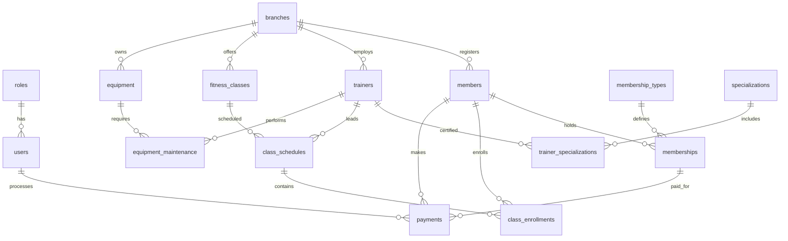

# Fitness Center Management System

A full-stack solution for managing a fitness center: SQL Server database with business rules, audit logging, role-based access, and a .NET 8 console application using ADO.NET.

## Project Structure

```
FitnessCenterManagement/
├── database/
│   └── fitnesscenter_database.sql    # Single deployment script (schema + data + security)
├── FitnessCenterManagement/
│   ├── Configuration/                # appsettings.json loader
│   ├── Data/                         # DatabaseHelper (ADO.NET)
│   ├── Models/                       # Entity models
│   ├── Repositories/                 # CRUD repositories (3 parts)
│   ├── Services/                     # Reports & analytics
│   ├── UI/                           # Hierarchical console menu
│   ├── appsettings.json              # Connection string configuration
│   └── Program.cs                    # Entry point
├── FitnessCenterManagement.sln
└── README.md
```

## Requirements

| Component | Version |
|-----------|---------|
| .NET SDK | 6.0 or newer (project targets **net8.0**) |
| SQL Server | 2019+ or SQL Server Express / LocalDB |
| OS | Windows (recommended), Linux/macOS with SQL Server |

## Quick Start

### 1. Deploy the Database

Open **SQL Server Management Studio (SSMS)** or run via **sqlcmd**:

```powershell
sqlcmd -S localhost -E -i database\fitnesscenter_database.sql
```

Or in SSMS: open `database/fitnesscenter_database.sql` and execute (F5).

The script will:
- Drop and recreate `fitnesscenter_db`
- Create 16 related tables with foreign keys
- Create views, triggers, stored procedures
- Configure 4 database roles with GRANT/REVOKE
- Insert 20–30+ test records per main table

### 2. Configure Connection String

Edit `FitnessCenterManagement/appsettings.json`:

```json
{
  "ConnectionStrings": {
    "FitnessCenterDb": "Server=localhost;Database=fitnesscenter_db;Trusted_Connection=True;TrustServerCertificate=True;"
  }
}
```

For SQL authentication:

```json
"FitnessCenterDb": "Server=localhost;Database=fitnesscenter_db;User Id=sa;Password=YourPassword;TrustServerCertificate=True;"
```

### 3. Build and Run

```powershell
cd FitnessCenterManagement
dotnet restore
dotnet build
dotnet run
```

You can also change the connection string at runtime via menu option **10. Connection Settings**.

## Database Schema

### Entity Relationship Overview



### Tables (16 entities)

| Table | Description |
|-------|-------------|
| `roles` | System roles (administrator, manager, trainer, guest) |
| `users` | Application users linked to roles |
| `branches` | Fitness center locations |
| `membership_types` | Subscription plans (basic, premium, annual, etc.) |
| `members` | Gym members/clients |
| `memberships` | Active/expired member subscriptions |
| `trainers` | Fitness instructors |
| `specializations` | Training specializations (yoga, crossfit, etc.) |
| `trainer_specializations` | Trainer certification mapping |
| `fitness_classes` | Group class definitions |
| `class_schedules` | Scheduled class sessions |
| `class_enrollments` | Member class registrations |
| `equipment` | Gym equipment inventory |
| `equipment_maintenance` | Maintenance records |
| `payments` | Payment transactions |
| `audit_log` | Change audit trail |

### Soft Delete

All business tables include:
- `isactive` (bit) — record is usable
- `isdeleted` (bit) — soft delete flag
- `createdat`, `updatedat` — timestamps

Application CRUD uses soft delete (`isdeleted = 1, isactive = 0`).

### Additional Attributes (7+ per domain entity)

Examples of extended fields beyond basic CRUD:
- **members**: `emergency_contact`, `health_notes`, `referral_source`, `fitness_goal`, `loyalty_points`
- **trainers**: `certification_expiry`, `bio`, `rating`, `employment_type`, `max_clients_per_day`
- **membership_types**: `guest_passes`, `freeze_days_allowed`, `includes_personal_training`
- **branches**: `parking_spaces`, `has_pool`, `opening_hours`
- **fitness_classes**: `calories_burn_estimate`, `equipment_required`
- **equipment**: `manufacturer`, `condition_status`, `warranty_until`

### Views

| View | Purpose |
|------|---------|
| `vw_active_memberships` | Active memberships with member and branch info |
| `vw_class_schedule_overview` | Upcoming classes with trainer and capacity |
| `vw_trainer_workload` | Trainer class and enrollment counts |
| `vw_equipment_status` | Equipment condition and maintenance status |
| `vw_revenue_summary` | Daily revenue by payment method |

### Stored Procedures (with TRY/CATCH + transactions)

| Procedure | Description |
|-----------|-------------|
| `sp_register_member` | Register member, optionally create initial membership |
| `sp_create_membership` | Create membership with business rule checks |
| `sp_enroll_in_class` | Enroll member with capacity and membership validation |
| `sp_process_payment` | Process payment and update loyalty points |

### Triggers

| Trigger | Purpose |
|---------|---------|
| `trg_memberships_audit` | Audit membership insert/update/delete |
| `trg_payments_audit` | Log all payment changes |
| `trg_class_enrollments_capacity` | Validate class capacity, update enrollment count |
| `trg_members_soft_delete` | Log member soft deletes |

### Database Roles (GRANT/REVOKE)

| Role | Access Level |
|------|--------------|
| `fitness_admin_role` | Full CRUD + execute all procedures |
| `fitness_manager_role` | Operational CRUD, no user/role delete |
| `fitness_trainer_role` | Classes, enrollments, read members |
| `fitness_guest_role` | Read-only on views and catalog tables |

## Console Application Features

### Hierarchical Menu

```
MAIN MENU
├── 1. Members & Memberships      (Members, Memberships CRUD + SP)
├── 2. Classes & Schedules        (Classes, Schedules, Enrollments CRUD + SP)
├── 3. Trainers & Specializations
├── 4. Equipment & Maintenance
├── 5. Branches & Membership Types
├── 6. Administration             (Users, Roles)
├── 7. Reports & Analytics        (7 reports)
├── 8. Audit Log
├── 9. Global Search
└── 10. Connection Settings
```

### CRUD Operations

Full Create, Read, Update, Soft Delete for all 15 business entities plus search/filter on key tables.

### Reports (7 analytics)

1. Revenue by Payment Method
2. Memberships by Status
3. Classes by Category
4. Trainer Workload
5. Equipment Status Summary
6. Top Members by Loyalty Points
7. Monthly Revenue Trend

## Example SQL Queries

```sql
-- Active memberships with member details
select * from vw_active_memberships where status = 'active';

-- Upcoming classes this week
select * from vw_class_schedule_overview
where start_time between sysutcdatetime() and dateadd(day, 7, sysutcdatetime());

-- Revenue by payment method
select payment_method, sum(total_revenue) as revenue
from vw_revenue_summary
group by payment_method;

-- Register member via stored procedure
declare @member_id int;
exec sp_register_member
    @branch_id = 1,
    @first_name = 'john',
    @last_name = 'doe',
    @phone = '+7-900-000-0000',
    @email = 'john@example.com',
    @membership_type_id = 2,
    @member_id = @member_id output;
select @member_id as new_member_id;

-- Enroll member in class
declare @enrollment_id int;
exec sp_enroll_in_class @schedule_id = 1, @member_id = 1, @enrollment_id = @enrollment_id output;

-- Audit log for payments
select * from audit_log where table_name = 'payments' order by changed_at desc;
```

## Test Data Summary

| Table | Records |
|-------|---------|
| members | 30 |
| memberships | 30 |
| trainers | 8 |
| fitness_classes | 10 |
| class_schedules | 30 |
| class_enrollments | 30 |
| equipment | 15 |
| payments | 30 |
| branches | 5 |
| membership_types | 8 |

Default users: `admin`, `manager1`, `trainer1`, `guest1` (password hashes are placeholders).

## Troubleshooting

| Issue | Solution |
|-------|----------|
| Connection failed | Verify SQL Server is running; check connection string in `appsettings.json` |
| Database not found | Run `database/fitnesscenter_database.sql` |
| Login failed | Use `TrustServerCertificate=True` for local dev; verify Windows/SQL auth |
| Class enrollment error | Ensure member has active membership and class is not full |

## License

Educational / academic project. Free to use and modify.
